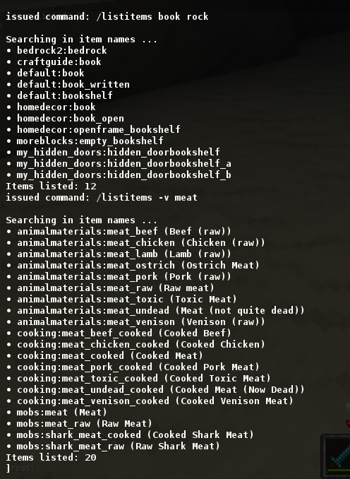

# List Items (***listitems***) chat command for [Minetest][]


---
### **Description:**

#### Chat Commands:
- ***listitems:*** Lists registered craft items available in the game.
- ***listentities:*** Lists registered entities available in the game.
- ***listores:*** Lists registered ores available in the game.
- Invocation: ```/<command> [options] [string1] [string2] ...```
  - ***command:*** Name of the command (e.g. *listitems*, *listentities*, etc.)
  - ***options:*** Switches to control output behavior.
    - ***-v:*** Display description (if available) after object name
  - ***string[1,2] ...:*** String parameter(s) to filter output.
  - Without any string parameters, all objects registered in game are listed.
  - With string parameters, only objects matching any of the strings will be listed.




---
### **Licensing:**

- [MIT](LICENSE.txt)


---
### **Requirements:**

- **Depends:** none
- **Privileges:** none


---
### **Documentation:**

- [API Documentation](https://antummt.github.io/mod-listitems/api.html)


[Minetest]: http://www.minetest.net/
